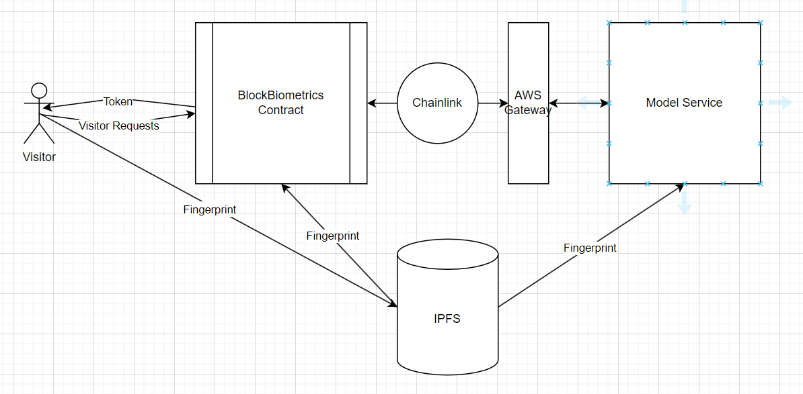
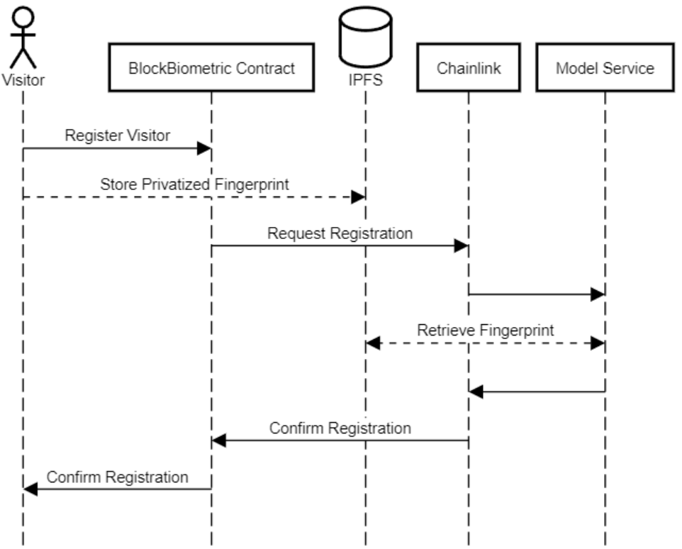
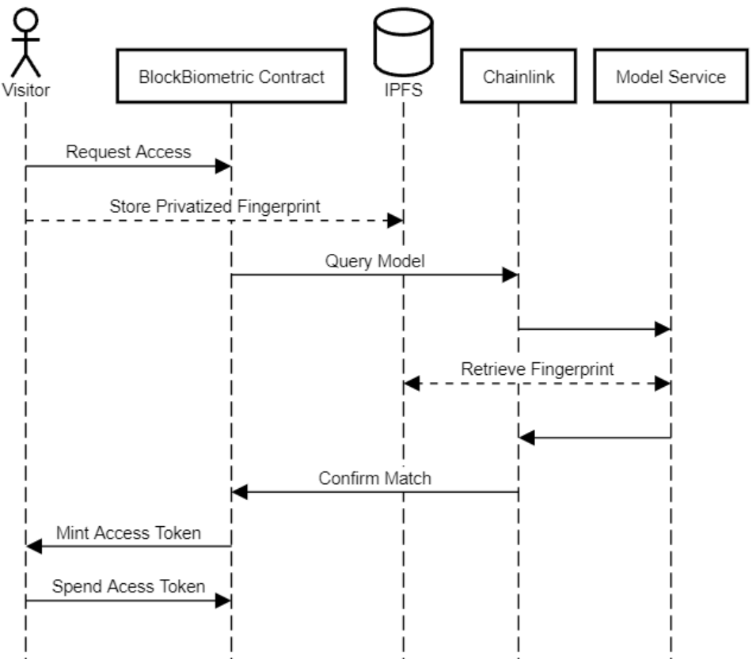

# S24_BlockBiometrics

# Block Biometrics

Block biometrics is a project that incorporates biometric authentication into a security system where there is little trust between users. Our implementation of the system focuses on the scenario of home security. In a home security system, the owner would like to maintain a log of visitors that can not be tampered and would like the visitors to provide proof of their identity. Traditionally users may use a specific account associated with their identity which only they may have access to certain private keys for. These private keys however can easily be lost or potentially be stolen by a clever attacker if storage of the keys is not secure. The most secure way to authenticate this user with the system is to use their biometric data. In summary we want a tamperproof access control system.

To address this concern we have developed an ethereum smart contract based system that makes use of private AI to control user access.

## Goals

Our goals for this project are the following:
* Develop a model that will allow for fingerprint recognition while maintaining privacy of users transmitting fingerprint data
* Develop a smart contract that can allow for access control upon authentication with our model

While these goals are quite simple there are some design challenges to consider. Our proposed design solution is layed out in the next solution

## Design

Our smart contract will be deployed by an owner, representing the owner of the security system, typically the homeowner. This contract will mint NFTs (Non-Fungible Tokens) that can only be transferred a single time between the user and the owner after they are minted. These NFTs will serve as access tokens and will be time-stamped at the point of minting and transfer.

A visitor will undergo an initial registration phase where they register their fingerprint with the system. Any time the fingerprint is transmitted by the visitor, it will first be privatized. Once privatized, the fingerprint data will be stored on IPFS, and the corresponding link will be sent to the contract. The contract will then send a request to our machine learning model. If the model returns a positive result, indicating a match with an authorized fingerprint, an access NFT will be minted.

We will host our machine learning model on AWS with an HTTP endpoint. This model will be trained using a fingerprint dataset and be deployed a single time.

The proposed blockchain architecture leverages Ethereum smart contracts, IPFS, and machine learning models to create a secure, privacy-preserving, and tamper-proof access control system for home security, addressing the challenges of trust and privacy in a decentralized manner.

### Component Diagram

### Sequence Diagrams

#### Registration

#### Visitor Access Request

